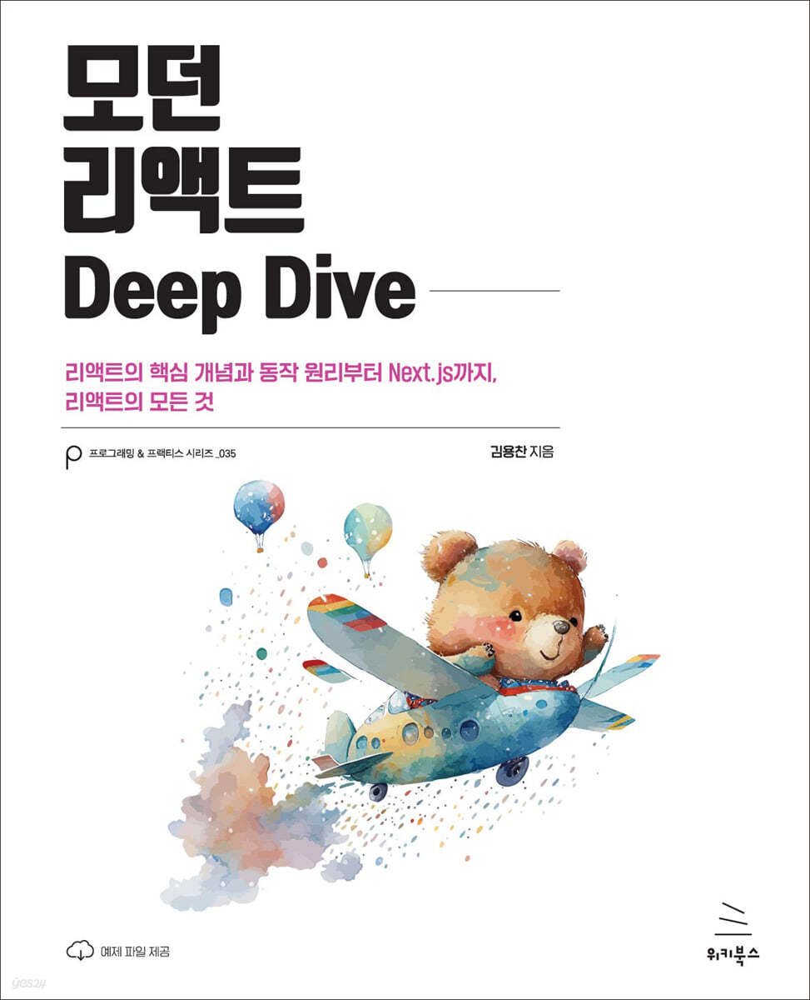

# 🐻 [모던 리액트 딥 다이브] 스터디 🐻

|  |
| ------------------------------------------------- |

 

## ✨ 스터디 방식 ✨

- 스터디는 주 1회 (미정) 진행됩니다.
- 스터디 주차는 챕터와 동일합니다. 모든 스터디원들은 당일까지 해당 챕터를 읽어옵니다.
- 모든 스터디원들은 주차별 챕터 내용을 각자의 브랜치/챕터 파일에 마크다운 형식으로 정리합니다.
  - 요약본은 markdown으로 작성하고 제목은 담당자의 이름입니다.
  - 챕터 명으로 만들어진 폴더에 업로드합니다. (ex. [2장] 챕터 이름)
  - branch : 개인별 브랜치
  - commit message : 템플릿 연결해서 하셔도 되고, 각자 스타일에 맞게 하셔도 됩니다.
  - 스터디 시작 전까지 main 브랜치에 PR을 올려주세요.
  - PR : 🌱: [2장] 챕터 이름 - 박진수
- 모든 스터디원들은 각 챕터에 해당하는 문제를 준비합니다.
  - [GitHub issue](https://github.com/React-DeepDive/DeepDive/issues)로 해당 챕터의 label을 적용하여 문제를 작성합니다.
  - 문제 제목은 챕터와 문제 제목으로 설정합니다. (ex. [2장] 문제 제목)
  - 문제 양식은 제공된 템플릿에 맞춰서 작성해주세요.
  - 문제는 스터디 진행 전날까지 1인 1회 이상 등록합니다.
  - 문제 출제자를 제외한 나머지 스터디원은 문제가 등록된 시점부터 스터디 진행 30분 전까지 문제에 대한 답안을 답변으로 작성합니다.
- 스터디는 1시간 동안 진행됩니다.
  - 전반 30분 동안 다 함께 정리본을 읽고 챕터에 대한 질의응답을 진행합니다.
  - 후반 30분 동안 출제된 문제와 답변을 확인합니다. 출제자는 issue에 마지막 순서로 최종 답안을 작성하면서 해당 issue를 종료시킵니다.
- 스터디 종료 후 main 브랜치에 merge를 진행합니다.

 

## 📅 일정표 📅

<table>
<tbody>
<tr>
<td align="center" colspan="5">1주차</td>
</tr>
<tr>
<td align="center">날짜 미정</td>
<td colspan="4">OT</td>
</tr>
</tbody>
</table>

 

## 😎 스터디원 😎

<table>
<tbody>
<tr>
<td align="center"></td>
<td align="center"></td>
<td align="center"></td>
</tr>
<tr>
<th align="center">박진수</th>
<th align="center">최훈오</th>
<th align="center">진현주</th>
</tr>
<tr>
<td align="center" width="150"><a href="https://github.com/jinsupark4255">@jinsupark4255</a></td>
<td align="center" width="150"><a href="https://github.com/Whoknow77">@Whoknow77</a></td>
<td align="center" width="150"><a href="https://github.com/realzu">@realzu</a></td>
</tr>
</tbody>
</table>

